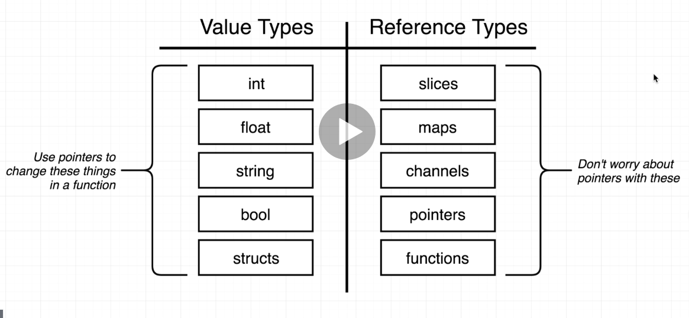

## Declaração de variável

Para declarar varipaveis no Go usa-se
```golang
var texto string = "texto"
```
porém uma das forma mais utilizadas é
```golang
texto := "texto"
```
com essa segunda forma já declara a variável e o tipo dela já fica sendo o do valor que ela recebe.

## Receiver functions

Apesar de Go não ser orientada a objetos em si, podemos fazer com que tipos possam executar funções com o valor deles, mais ou menos como podemos fazer com julia em certos momentos.

Considerando o seguinte código

``` golang
type deck []string

func (d deck) print() {
	for i, card := range d {
		fmt.Println(i, card)
	}
}
```
definimos um tipo e após isso definimos uma função que pode ser chamada pelo tipo __deck__ para imprimir os valores existentes nele. É bem parecido com a chamada de um método de um objeto, só que aqui aplicado à estruturas e tipos.

# Structs
vamos criar uma struct para conter o nome e sobrenome de uma pessoa

```go
type pessoa struct {
	nome string
	sobrenome string
}
```
Para declarar uma variável do tipo pessoa podemos utilizar a sintaxe a seguir

```go
func main () {
	alex := pessoa{"Alex", "Oliveira"}
}
```
o problema com ela é que conideramos que os dados são inseridos conforme a ordem utilizada na declaração da struct. Uma forma de controlar onde cada entrada deve ser salva dentro da struct é a seguinte

```go
func main () {
	alex := pessoa{nome:"Alex", sobrenome: "Oliveira"}
}
```

# Pass by value

No Go cada vez que uma variável é passada como parâmetro, uma nova cópia da variável é criada e passada para a função ou método chamado. A cópia é alocada em um endereço de memória diferente.

Isso faz com que ao passarmos uma variável para uma função e modificarmos o seu valor dentro desta função, o valor da variável original não é modificado, pois a função recebeu uma cópia desse valor e modificou ele. PAra que seja possível modificar o valor da variável original é necessário trabalhar com ponteiros.

Nem todas os tipos passam os valores, alguns passam a referência mesmo, neste casos não precisamos nos preocupar com o uso deponteiros com estes. Um resumo sobre isso é apresentado na figura a seguir.



## Maps

Maps em Go são mais ou menos equivalentes ao que dicionários são na linguagem Julia.